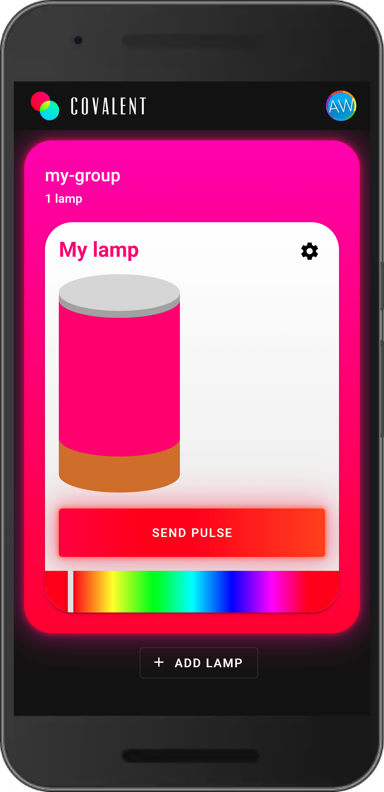

### Covalent (adjective, chemistry)

#### /ˌkōˈvālənt/
relating to or denoting chemical bonds formed by the sharing of electrons between atoms

## Documentation

- [User guide](/docs/user-guide.md)
- [Bluetooth protocol](/docs/bluetooth.md)
- [Websocket protocol](/docs/websockets.md)

## Screenshots

  
  
  
  
  
  

